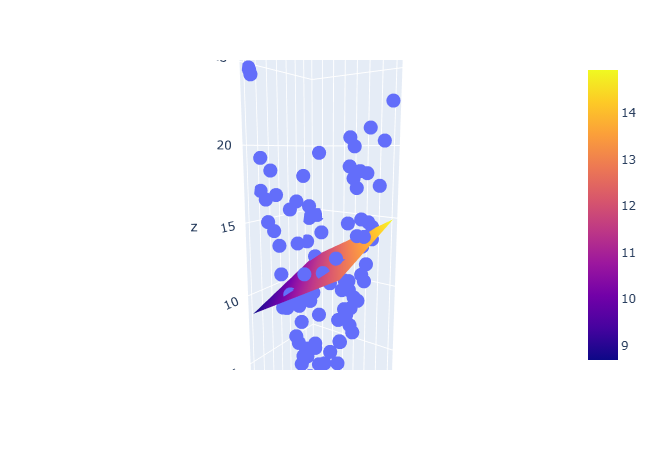

<h1>``Creating Polynomial Linear Regression from Scratch``</h1>
<p>
    Basic Mathematical Logic to build a Polynomial Linear Regression Model from formulas..
</p>




```
Multiple Linear Regression/
│
├── pic
├── LR.ipynb
└── README.md
```

<h2>⭐ Support</h2>

<p>
    If you found this project useful, consider giving it a star ⭐
    on GitHub.
</p>